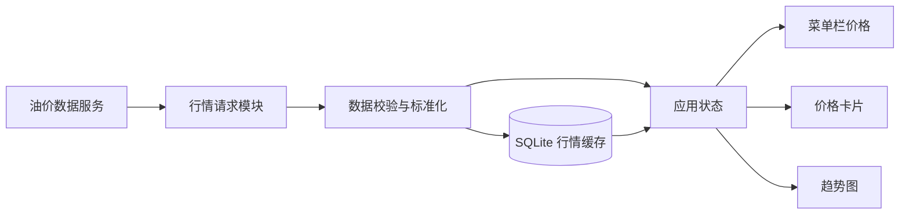

# Oil Monitor 产品需求文档

## 1. 文档信息


| 项目   | 内容            |
| ---- | ------------- |
| 产品名称 | Oil Monitor   |
| 产品形态 | macOS 原生菜单栏应用 |
| 使用对象 | 个人用户          |
| 目标平台 | macOS         |
| 文档版本 | v1.0          |
| 当前阶段 | MVP           |
| 更新日期 | 2026-06-27    |


## 2. 产品概述

Oil Monitor 是一款轻量的 macOS 菜单栏应用，用于快速查看 Brent（布伦特原油）和 WTI（美国西德克萨斯中质原油）价格及近期走势。

应用常驻 Mac 顶部菜单栏。用户无须打开浏览器或进入完整应用窗口，只需点击菜单栏图标，即可查看最新价格、涨跌情况和趋势图。

本产品面向个人查看场景，不用于下单交易，也不承诺提供交易所级实时行情。

## 3. 产品目标

### 3.1 核心目标

- 让用户在 1 次点击内查看 Brent 和 WTI 最新价格。
- 用简洁趋势图展示油价近期变化。
- 保持应用轻量、安静，避免占用过多系统资源。
- 每次打开悬浮面板时自动获取最新数据。
- 支持定时更新、手动更新和强制手动更新。
- 网络不可用时仍可展示最近一次成功获取的数据。

### 3.2 非目标

MVP 阶段不包含：

- 原油交易、开户或下单功能。
- 秒级行情或交易所级实时数据。
- 新闻、研报和行情预测。
- 多用户系统、账户注册或云端同步。
- iPhone、iPad、Windows 或 Android 客户端。
- 复杂技术指标和专业 K 线分析。
- 价格预警通知。

## 4. 用户场景

### 场景一：快速查看

用户工作时想了解当前油价，点击 Mac 菜单栏中的 Oil Monitor，即可看到 Brent 和 WTI 当前价格、涨跌幅和更新时间。

### 场景二：查看走势

用户想了解近期油价方向，在弹出面板中切换时间范围，查看 Brent 和 WTI 的趋势图。

### 场景三：手动更新

用户认为当前数据可能已经过期，点击刷新按钮，应用立即重新获取行情。

### 场景四：打开时自动更新

用户点击菜单栏图标打开悬浮面板。应用先立即展示本地缓存，然后自动请求一次最新行情；请求成功后，页面中的价格、涨跌和趋势图自动更新。

### 场景五：强制手动更新

当普通更新未获得新数据，或用户希望确认数据源的最新状态时，可点击“强制更新”。应用忽略本地数据新鲜度和普通刷新冷却时间，直接向数据源发起新请求。

### 场景六：离线查看

网络不可用或数据接口异常时，应用显示最近一次成功获取的数据，同时明确标注数据时间和离线状态。

## 5. 产品范围

### 5.1 MVP 功能清单


| 编号   | 功能                 | 优先级 |
| ---- | ------------------ | --- |
| F-01 | 显示 Brent 最新价格      | P0  |
| F-02 | 显示 WTI 最新价格        | P0  |
| F-03 | 显示涨跌额和涨跌幅          | P0  |
| F-04 | 显示最近更新时间           | P0  |
| F-05 | 展示价格趋势图            | P0  |
| F-06 | 支持 1 天、1 周、1 月时间范围 | P0  |
| F-07 | 每次打开悬浮面板时自动刷新      | P0  |
| F-08 | 定时自动刷新             | P0  |
| F-09 | 普通手动更新             | P0  |
| F-10 | 强制手动更新             | P0  |
| F-11 | 本地缓存最近一次有效数据       | P0  |
| F-12 | 显示加载、离线及接口异常状态     | P0  |
| F-13 | 开机自动启动开关           | P1  |
| F-14 | 刷新频率设置             | P1  |
| F-15 | 菜单栏显示内容设置          | P2  |


### 5.2 后续可选功能

- 自定义价格提醒。
- 涨跌颜色和主题设置。
- 增加年初至今、3 个月、1 年趋势。
- 导出历史数据。
- 桌面 Widget。
- 更多能源品种，例如天然气、汽油和取暖油。

## 6. 功能需求

### 6.1 菜单栏

- 应用启动后常驻 macOS 顶部菜单栏。
- 默认不显示在 Dock 和应用切换器中。
- 菜单栏默认显示油滴或折线图图标。
- 可选增强：在空间足够时显示简短价格，例如 `B 82.45 · W 78.21`。
- 点击菜单栏区域后，打开悬浮面板。
- 点击面板外部区域后，面板自动收起。

### 6.2 价格卡片

应用分别展示 Brent 和 WTI 价格卡片。每张卡片包含：

- 品种名称。
- 最新价格。
- 计价单位，默认显示 `USD / barrel`。
- 涨跌额。
- 涨跌幅。
- 数据时间。

展示规则：

- 上涨使用绿色和向上箭头。
- 下跌使用红色和向下箭头。
- 无变化使用中性色。
- 无有效数据时显示 `--`，不得显示伪造价格。
- 价格默认保留两位小数。
- 涨跌幅默认保留两位小数。

> 注：涨跌颜色遵循国际金融产品常用习惯，即绿涨红跌。

### 6.3 趋势图

- 默认展示 Brent 趋势。
- 用户可在 Brent 和 WTI 之间切换。
- 支持 `1D`、`1W`、`1M` 三个时间范围。
- 趋势图使用简洁折线，不展示复杂技术指标。
- 图表应显示最高价、最低价或必要的价格刻度。
- 鼠标悬停在曲线上时，显示对应时间和价格。
- 数据点不足时仍应正常展示，并提示数据范围有限。
- 图表加载不得阻塞价格卡片显示。

### 6.4 数据刷新

- 应用启动时立即读取本地缓存并展示。
- 应用启动后尝试获取一次最新行情。
- 用户每次点击菜单栏图标打开悬浮面板时，应用必须自动执行一次刷新。
- 打开面板时先显示已有缓存，不得等待网络请求完成后才显示界面。
- 自动刷新成功后，当前价格、涨跌信息、更新时间和趋势图应在面板内自动更新。
- 如果打开面板时已有请求正在执行，应复用该请求，避免重复请求。
- 默认每 30 分钟自动刷新一次。
- 用户可设置为 15、30 或 60 分钟。
- 面板同时保留“更新”和“强制更新”两个手动操作。
- 点击“更新”后立即检查并获取新数据；普通更新允许复用正在执行的请求，并受约 10 秒防重复点击限制。
- 点击“强制更新”后，忽略本地缓存的新鲜度和普通更新冷却时间，直接向数据源发起新请求。
- 强制更新仍须遵守数据供应商的请求频率限制；按钮连续点击时只允许存在一个强制更新请求。
- 如果强制更新时有普通请求正在执行，可取消普通请求或等待其结束后立即执行强制请求，最终必须以强制请求结果为准。
- 刷新期间显示轻量加载状态，不清空已有价格。
- 自动、普通或强制更新失败时，继续展示最近一次有效数据并标明失败状态。
- 每次成功刷新后更新本地缓存和最后更新时间。

### 6.5 异常与离线状态

发生网络断开、请求超时、接口限流或数据格式异常时：

- 保留并展示最近一次成功获取的数据。
- 显示“当前为缓存数据”或“更新失败”状态。
- 显示缓存数据对应的实际时间。
- 提供重新刷新入口。
- 不使用模态弹窗反复打扰用户。
- 不因单个品种获取失败而隐藏另一个品种的有效数据。

### 6.6 设置

设置区域至少包含：

- 自动刷新频率：15、30、60 分钟。
- 开机自动启动开关。
- 菜单栏是否显示价格。
- 关于页面：版本号、数据来源说明和免责声明。

设置保存在 Mac 本地，不要求用户登录。

### 6.7 退出

- 悬浮面板或设置菜单中提供“退出 Oil Monitor”入口。
- 退出后停止所有定时任务和网络请求。

## 7. 页面与交互

### 7.1 悬浮面板草图

```text
┌──────────────────────────────────┐
│ Oil Monitor              刚刚更新│
├────────────────┬─────────────────┤
│ Brent          │ WTI             │
│ $82.45         │ $78.21          │
│ ▲ 0.53  0.65%  │ ▼ 0.25  0.32%  │
├────────────────┴─────────────────┤
│ Brent   WTI                      │
│                                  │
│       ╭──╮       ╭────╮          │
│  ─────╯  ╰───────╯    ╰──       │
│                                  │
│        1D     1W     1M          │
├──────────────────────────────────┤
│ ● 数据正常    更新  强制更新  ⚙ │
└──────────────────────────────────┘
```

### 7.2 建议尺寸

- 面板宽度：约 360～420 pt，可以调整。
- 面板高度：约 400～500 pt，可以调整。
- 价格应是界面中视觉优先级最高的内容。
- 支持 macOS 浅色和深色模式。

### 7.3 交互原则

- 用户无需学习即可使用。
- 核心信息在打开面板后立即可见。
- 不增加多级导航。
- 不使用广告、资讯流或无关动效。
- 状态变化应清晰，但避免频繁通知。

## 8. 数据需求

### 8.1 数据字段

每条价格数据至少包含：


| 字段            | 说明     |
| ------------- | ------ |
| symbol        | 品种标识   |
| name          | 品种名称   |
| price         | 最新价格   |
| currency      | 计价货币   |
| unit          | 计价单位   |
| change        | 涨跌额    |
| changePercent | 涨跌幅    |
| timestamp     | 行情数据时间 |
| source        | 数据来源   |


历史趋势数据至少包含：

- 品种标识。
- 时间戳。
- 价格。

### 8.2 数据源原则

- 数据源必须同时支持 Brent 和 WTI。
- 优先选择稳定、无需复杂认证或低成本的数据源。
- 允许使用延迟行情。
- 数据访问层与界面层解耦，方便未来替换数据供应商。
- 应遵循数据供应商的使用条款和请求频率限制。
- 界面应明确展示数据来源及可能存在的延迟。

### 8.3 本地缓存

- 所有行情缓存统一存储在本地 SQLite 数据库中，不再使用 JSON 文件保存行情数据。
- SQLite 至少保存最新价格快照、历史趋势数据、数据来源、行情时间和最后成功刷新时间。
- 应用启动时从 SQLite 读取最近一次有效价格并立即展示。
- 每次行情请求成功后，应在同一事务中写入最新价格和对应历史数据，避免出现部分更新。
- 相同品种、相同数据时间的记录应去重，防止重复刷新产生重复数据。
- 应建立必要的时间和品种索引，保证趋势查询及启动读取速度。
- 历史数据应设置保留或清理策略，避免数据库无限增长。
- 数据库文件损坏或结构升级失败时，不得导致应用无法启动；应用应给出错误状态，并允许重建行情缓存。
- 用户界面偏好可继续使用 `UserDefaults` / `AppStorage`，不得在其中存储行情数据。

建议的最小数据表：


| 数据表                | 用途            | 主要字段                                                  |
| ------------------ | ------------- | ----------------------------------------------------- |
| `latest_prices`    | 保存每个品种的最新有效价格 | symbol、price、change、change_percent、market_time、source |
| `price_history`    | 保存趋势图历史价格     | symbol、price、market_time、source                       |
| `refresh_metadata` | 保存刷新状态        | last_success_at、last_attempt_at、status、error_message  |


## 9. 技术架构




### 9.1 推荐技术

- 开发语言：Swift。
- UI：SwiftUI。
- 菜单栏容器：`MenuBarExtra`。
- 网络请求：`URLSession`。
- 图表：Swift Charts。
- 设置存储：`UserDefaults` / `AppStorage`。
- 行情缓存：SQLite。
- 开机启动：macOS Service Management。

### 9.2 运行方式

- 应用以独立 `.app` 形式运行。
- 不依赖浏览器。
- 不启动本地 Web 服务。
- 不要求用户安装 Python、Node.js 或数据库。
- 应用可直接从 Finder 或 Launchpad 启动。

## 10. 非功能需求

### 10.1 性能

- 从缓存启动并显示价格的目标时间不超过 1 秒。
- 打开悬浮面板时应流畅，无明显卡顿。
- 网络请求不得阻塞主线程。
- 空闲状态下应尽量降低 CPU 占用。
- 内存占用目标控制在 100 MB 以内。

### 10.2 稳定性

- 行情接口失败不得导致应用崩溃。
- 系统从睡眠恢复后应重新检查数据是否过期。
- 网络恢复后应允许正常刷新。
- 系统时间、时区变化后，趋势图时间显示应保持正确。

### 10.3 隐私与安全

- 用户数据和设置只保存在本地。
- 不采集使用行为和个人信息。
- 如数据源需要 API Key，应存储在 macOS Keychain，不得明文写入代码或普通配置文件。
- 所有行情请求应使用 HTTPS。

### 10.4 兼容性

- MVP 建议支持 macOS 14 及以上版本。
- 支持 Apple Silicon Mac。
- 如开发成本可控，可兼容 Intel Mac。
- 支持系统浅色和深色模式。

## 11. 状态定义


| 状态    | 展示方式                |
| ----- | ------------------- |
| 初次加载  | 骨架或进度指示，价格显示 `--`   |
| 正常    | 展示最新价格和更新时间         |
| 刷新中   | 保留旧数据，刷新图标显示进度      |
| 强制刷新中 | 保留旧数据，禁用重复强制更新并显示进度 |
| 缓存数据  | 展示旧数据并标注“缓存”        |
| 离线    | 展示旧数据并标注“离线”        |
| 部分失败  | 正常展示成功品种，失败品种显示错误状态 |
| 完全无数据 | 显示友好说明及重试按钮         |


## 12. 验收标准

### 12.1 核心功能

- 启动应用后，菜单栏出现 Oil Monitor 图标。
- 点击图标后，面板能在 1 秒内打开。
- 每次打开面板时，应用都会自动发起或复用一次最新行情请求。
- 打开面板后先显示缓存数据，网络请求不得阻塞面板展示。
- 打开面板触发的请求成功后，价格和趋势图会自动更新。
- 获取成功时，同时显示 Brent 和 WTI 价格。
- 能正确显示价格、涨跌额、涨跌幅和数据时间。
- 能在 Brent 与 WTI 趋势之间切换。
- 能在 1D、1W、1M 时间范围之间切换。
- 点击“更新”按钮后能执行普通更新并更新数据。
- 点击“强制更新”按钮后能忽略本地数据新鲜度和普通冷却时间，发起新的行情请求。
- 连续点击“强制更新”时不会同时产生多个重复请求。
- 任意更新失败后，界面仍保留最近一次有效数据并显示失败状态。
- 应用能按照设置的刷新频率自动更新。

### 12.2 异常处理

- 断网后应用不崩溃。
- 有缓存时，断网后仍能看到最后一次价格。
- 无缓存且断网时，界面能说明当前无可用数据。
- 接口返回异常数据时不得展示明显错误价格。
- 单个品种失败时，另一个品种仍可正常使用。

### 12.3 系统体验

- 应用默认不出现在 Dock 中。
- 深色和浅色模式下文字均清晰可读。
- 退出应用后不再执行刷新任务。
- 开启开机启动后，重新登录系统时应用能够自动运行。

## 13. 里程碑建议

### 阶段一：可运行原型

- 建立菜单栏应用。
- 完成静态价格卡片和趋势图。
- 验证整体尺寸与交互。

### 阶段二：接入数据

- 接入 Brent 和 WTI 数据源。
- 完成数据标准化、刷新和本地缓存。
- 完成异常状态处理。

### 阶段三：完善体验

- 添加设置和开机启动。
- 适配浅色、深色模式。
- 完成性能、断网和睡眠恢复测试。
- 输出可直接安装的 `.app`。

## 14. 风险与约束

- 免费数据源可能存在延迟、限流、字段变化或停止服务的风险。
- Brent 和 WTI 可能对应不同合约月份，界面和数据说明必须明确具体品种定义。
- 不同数据源对“最新价”和“日涨跌”的计算基准可能不同。
- macOS 对后台任务和网络访问存在系统调度限制。
- 未签名或未公证的应用首次运行时可能触发 macOS 安全提示。

## 15. 免责声明

Oil Monitor 展示的数据仅供个人信息参考，不构成投资建议、交易建议或价格承诺。行情可能存在延迟或误差，用户不应将本应用作为交易决策的唯一依据。
